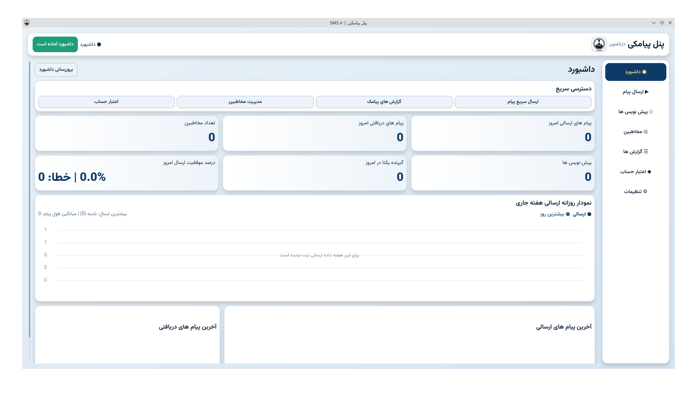
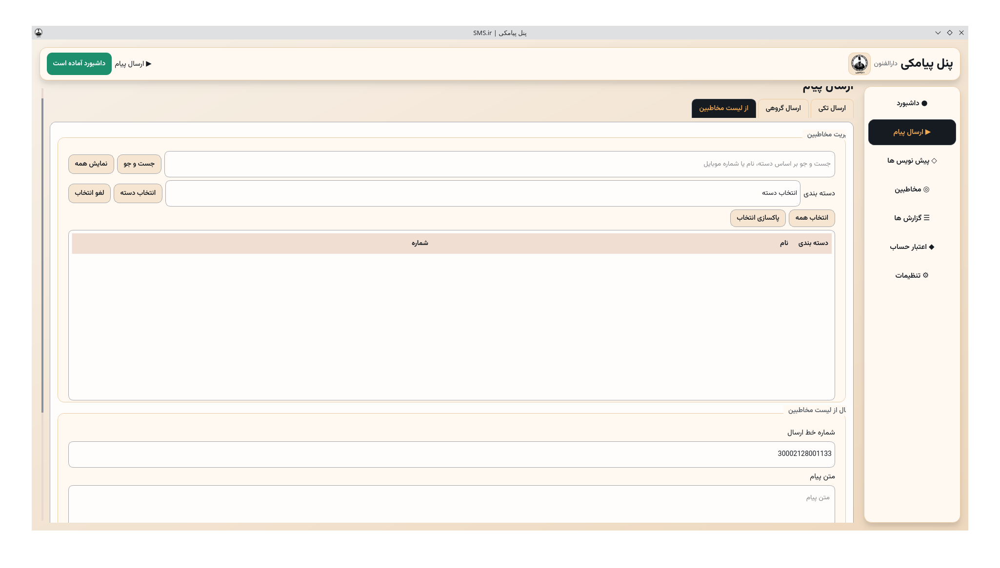
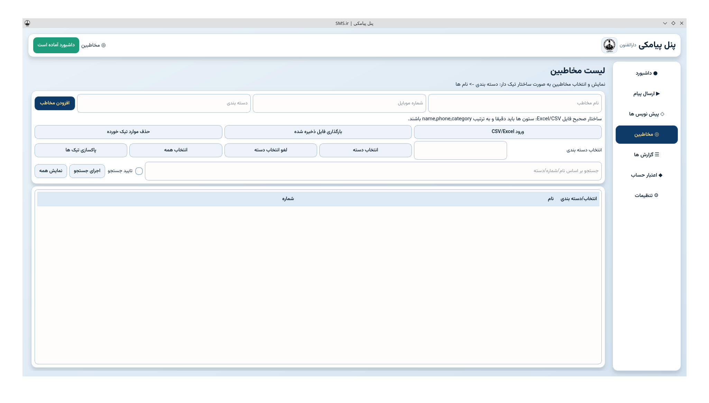
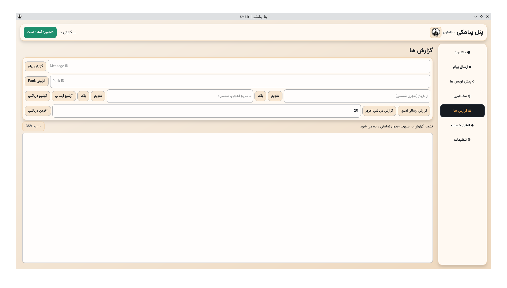

# پنل دسکتاپ SMS.ir (PyQt6)

اپلیکیشن دسکتاپ مدیریت پیامک برای سرویس `SMS.ir` با رابط فارسی، معماری ماژولار، و تمرکز روی استفاده روزمره مدرسه/سازمان.

## ویژگی ها

- ارسال پیام تکی و گروهی
- مدیریت مخاطبین (CSV/Excel)
- مدیریت پیش نویس ها
- نمایش گزارش ها و اعتبار پنل
- تم روشن/تیره و انتخاب رنگ رابط
- تنظیمات حرفه ای: هویت پنل، امنیت گذرواژه، اعلان ها، بکاپ/ریستور، لاگ و عیب یابی
- ساختار کدنویسی ماژولار برای توسعه تیمی

## تصاویر برنامه

### داشبورد اصلی

نمای کلی پنل شامل خلاصه وضعیت اعتبار، دسترسی سریع به بخش های پرکاربرد و نوار ناوبری فارسی.



### ارسال پیام

صفحه ارسال پیام تکی و گروهی با امکان انتخاب گیرنده ها، انتخاب خط فرستنده و پیش نمایش متن قبل از ارسال.



### مدیریت مخاطبین

مدیریت کامل مخاطبین شامل افزودن، ویرایش، جستجو و درون ریزی/برون بری از فایل های CSV و Excel.



### گزارش ها

مشاهده گزارش پیام های ارسال شده با فیلتر بر اساس بازه زمانی و وضعیت تحویل.



## پیش نیازها

- Python `3.10+`
- سیستم عامل لینوکس/ویندوز (PyQt6)

## نصب و اجرا

```bash
python3 -m venv .venv
source .venv/bin/activate
pip install -r requirements.txt
python3 -m sms_panel
```

گزینه جایگزین:

```bash
python3 sms_panel_desktop.py
```

## اجرای یک کلیکی (ویندوز + لینوکس)

- اسکریپت بوت استرپ پروژه: `run_sms_panel.py`
- لانچر لینوکس: `run_sms_panel.sh`
- لانچر ویندوز: `run_sms_panel.bat`

رفتار لانچر:
1) اگر یک نصب موفق قبلی وجود داشته باشد و `requirements.txt` تغییر نکرده باشد، مستقیم برنامه را اجرا می کند.
2) در غیر این صورت محیط مجازی `.venv` را از صفر می سازد.
3) از کاربر می پرسد که `pip` آپدیت بشود یا نه (پیش فرض: خیر).
4) وابستگی ها را از PyPI نصب می کند.
5) اگر هر مرحله شکست بخورد، از ابتدا تکرار می کند.
6) بعد از نصب موفق، فایل `sms_panel_desktop.py` را اجرا می کند.
7) در اولین اجرا، ترمینال بوت استرپ با جزئیات کامل مراحل نصب نمایش داده می شود.
8) در ویندوز، پس از نصب موفق، اجراهای بعدی بدون نمایش ترمینال و مستقیم با رابط گرافیکی انجام می شود.

اجرای سریع:

- لینوکس:
  ```bash
  chmod +x run_sms_panel.sh
  ./run_sms_panel.sh
  ```
- ویندوز:
  - با دوبار کلیک روی `run_sms_panel.bat`

تنظیم تعداد تلاش مجدد (اختیاری):

- متغیر محیطی `SMS_PANEL_BOOTSTRAP_RETRIES`
- مقدار پیش فرض `3` است.
- اگر مقدار `0` بگذارید، تلاش ها نامحدود می شود.

## تنظیمات اولیه

- تنظیمات اصلی در `sms_panel_settings.json` ذخیره می شود.
- برای شروع امن:
  1) فایل `sms_panel_settings.example.json` را کپی کنید با نام `sms_panel_settings.json`
  2) کلید API را یا در خود برنامه وارد کنید یا داخل `sms_api.txt` قرار دهید
- در اجرای اول اگر API Key تنظیم نشده باشد، پنجره ورود کلید نمایش داده می شود.
- بخش `تنظیمات` داخل برنامه شامل 10 گروه اصلی است:
  1) هویت پنل
  2) حساب و اتصال API
  3) پیش فرض های ارسال
  4) داده و پشتیبان گیری
  5) مخاطبین و پیش نویس ها
  6) اعلان ها
  7) ظاهر و تجربه کاربری
  8) امنیت و حریم خصوصی
  9) پیشرفته و عیب یابی
  10) درباره برنامه

## نکات امنیتی (مهم برای ریپوی پابلیک)

- فایل های زیر خصوصی هستند و نباید در GitHub پابلیک شوند:
  - `sms_api.txt`
  - `sms_panel_settings.json`
  - `contacts_import_cache.json`
  - `sms_panel/ui/logo.png`
  - `sms_panel/ui/logo.jpg`
- این فایل ها در `.gitignore` اضافه شده اند.
- اگر قبلا کلید واقعی API را در جایی منتشر کرده اید، حتما آن را از پنل `SMS.ir` **Rotate/Revoke** کنید.
- نبودن فایل لوگو مشکلی برای اجرا ایجاد نمی کند و برنامه بدون آیکون سفارشی اجرا می شود.

## ساختار پروژه

```text
sms_panel/
  app.py
  config.py
  core/
    models.py
    workers.py
  services/
    settings_store.py
    sms_ir_client.py
    contacts.py
    drafts.py
    response_parser.py
  ui/
    main_window.py
    theme.py
    widgets.py
    dialogs/
      api_key_dialog.py
    pages/
      dashboard_page.py
      send_page.py
      drafts_page.py
      contacts_page.py
      reports_page.py
      credit_page.py
      settings_page.py
sms_panel_desktop.py
run_sms_panel.py
run_sms_panel.sh
run_sms_panel.bat
```

## وابستگی ها

فایل `requirements.txt` شامل وابستگی های اصلی پروژه است:

- `PyQt6`
- `requests`
- `smsir-python`
- `pandas`
- `openpyxl`

## انتشار و مشارکت

- مجوز پروژه: `MIT` (فایل `LICENSE`)
- راهنمای مشارکت: `CONTRIBUTING.md`
